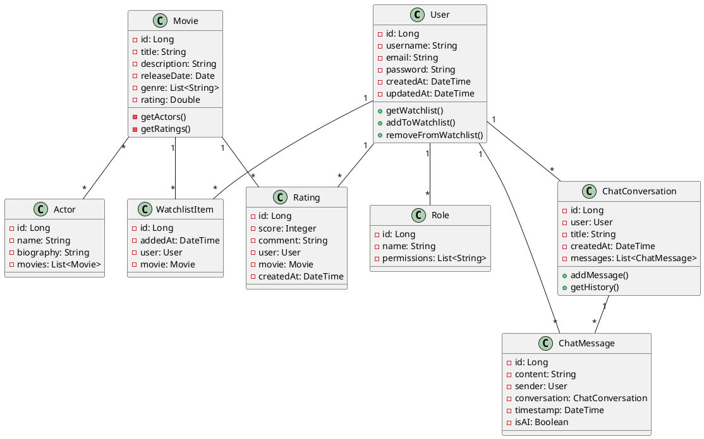
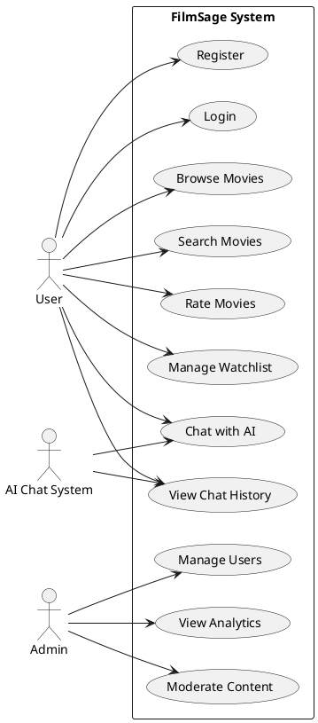
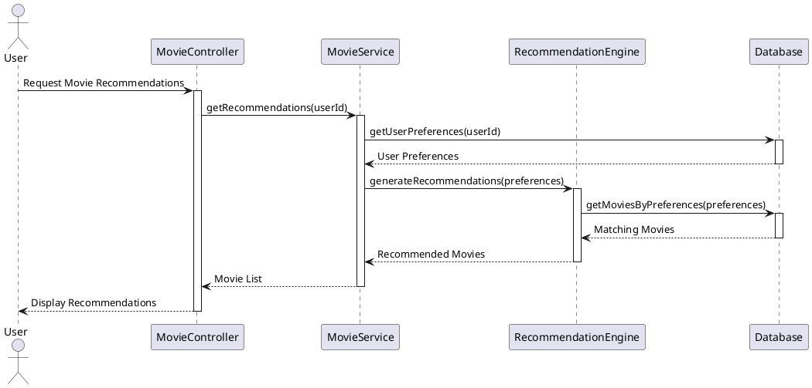
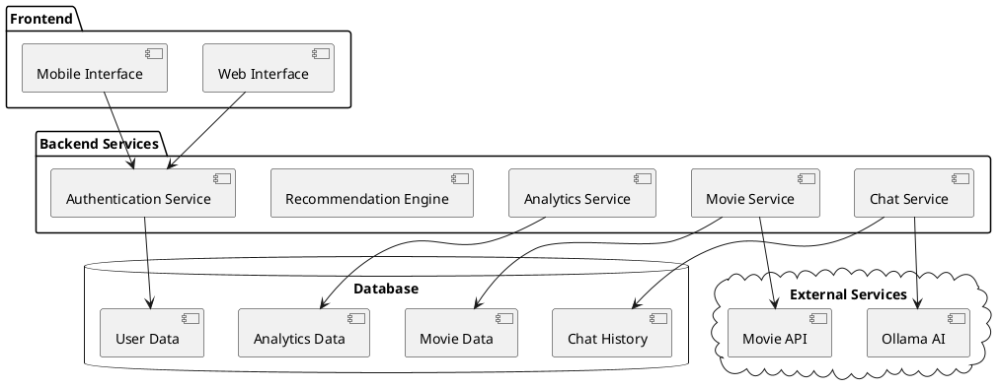

# FilmSage - Film Recommendation and Chat System

## Technical Specifications Document

### 1. Project Overview

FilmSage is a comprehensive film recommendation and chat system that combines movie discovery with interactive AI-powered conversations. The system provides personalized movie recommendations, user interaction features, and an intelligent chat interface for movie-related discussions.

### 2. Technical Stack

- **Backend Framework**: Spring Boot 3.2.1
- **Language**: Java 17
- **Database**: MySQL 8.0
- **ORM**: Spring Data JPA
- **Security**: Spring Security
- **Template Engine**: Thymeleaf
- **Build Tool**: Maven
- **Testing**: JUnit, JUnit Jupiter
- **Development Tools**: Lombok, Spring Boot DevTools

### 3. System Architecture

#### 3.1 Core Components

1. **Authentication & Authorization**

   - User registration and login
   - Role-based access control (Admin/User roles)
   - Secure session management

2. **Movie Management**

   - Movie catalog management
   - Movie search and filtering
   - Rating system
   - Watchlist functionality

3. **Chat System**

   - Real-time chat conversations
   - AI-powered responses
   - Chat history management
   - Conversation analytics

4. **Recommendation Engine**
   - Personalized movie recommendations
   - User preference analysis
   - Rating-based suggestions

#### 3.2 Data Models

1. **User Management**

   - User entity (authentication, profile)
   - Role entity (permissions)
   - WatchlistItem (user's saved movies)

2. **Movie Management**

   - Movie entity (movie details)
   - Actor entity (cast information)
   - Rating entity (user ratings)

3. **Chat System**
   - ChatConversation (conversation threads)
   - ChatMessage (individual messages)

#### 3.3 UML Diagrams

##### 3.3.1 Class Diagram

##### 3.3.2 Use Case Diagram

##### 3.3.3 Sequence Diagram (Movie Recommendation Flow)

##### 3.3.4 Component Diagram

### 4. Feature Specifications

#### 4.1 User Management

- User registration and authentication
- Profile management
- Role-based access control
- Watchlist management
- Rating and review system

#### 4.2 Movie Management

- Comprehensive movie database
- Movie search and filtering
- Detailed movie information
- Cast and crew information
- Rating and review system

#### 4.3 Chat System

- Real-time chat functionality
- AI-powered responses using Ollama
- Conversation history
- Message formatting and processing
- Analytics and insights

#### 4.4 Recommendation System

- Personalized movie suggestions
- User preference analysis
- Rating-based recommendations
- Watchlist integration

#### 4.5 Admin Features

- User management
- Content moderation
- System analytics
- Configuration management

### 5. API Endpoints

#### 5.1 Authentication

- `/auth/register` - User registration
- `/auth/login` - User login
- `/auth/logout` - User logout

#### 5.2 Movies

- `/movies` - Movie listing and search
- `/movies/{id}` - Movie details
- `/movies/rate` - Rate a movie
- `/movies/watchlist` - Watchlist management

#### 5.3 Chat

- `/chat/conversations` - Chat conversation management
- `/chat/messages` - Message handling
- `/chat/history` - Chat history retrieval

#### 5.4 Admin

- `/admin/users` - User management
- `/admin/analytics` - System analytics
- `/admin/config` - System configuration

### 6. Security Features

- JWT-based authentication
- Password encryption
- Role-based access control
- Session management
- Input validation and sanitization

### 7. Performance Considerations

- Database optimization
- Caching mechanisms
- Asynchronous processing
- Resource pooling
- Load balancing support

### 8. Testing Strategy

- Unit testing
- Integration testing
- Security testing
- Performance testing
- User acceptance testing

### 9. Deployment Requirements

- Java 17 runtime
- MySQL 8.0 database
- Maven build tool
- Sufficient memory for AI processing
- Network connectivity for external APIs

### 10. Future Enhancements

- Mobile application support
- Enhanced AI capabilities
- Social features integration
- Advanced analytics
- Content recommendation improvements

### 11. Maintenance and Support

- Regular security updates
- Performance monitoring
- Database maintenance
- Backup procedures
- User support system

This specification document provides a comprehensive overview of the FilmSage system. For detailed implementation details, please refer to the source code and API documentation.
